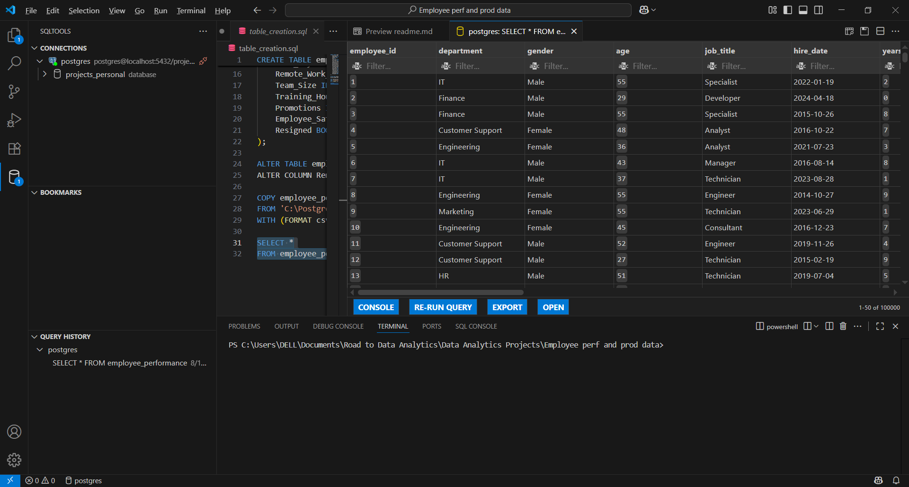
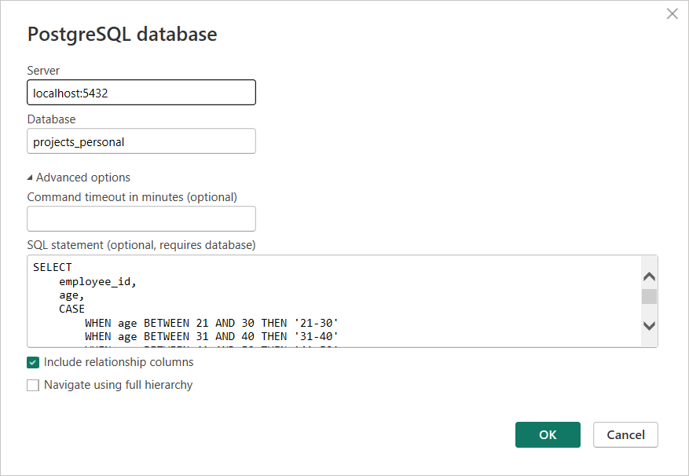
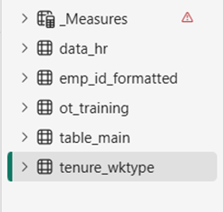
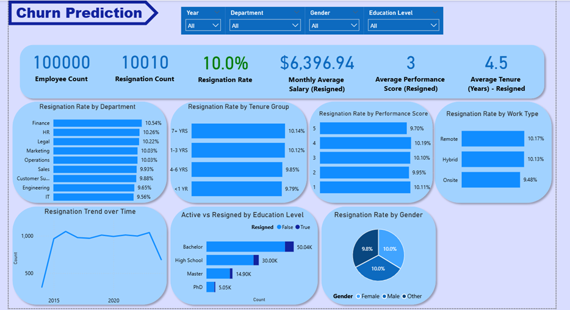
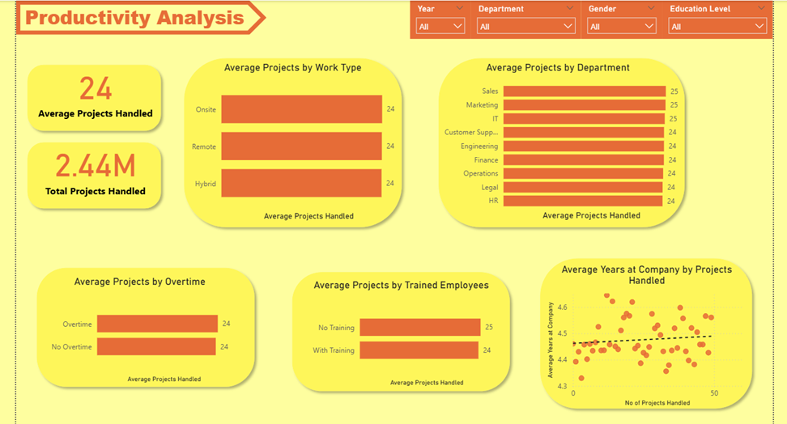
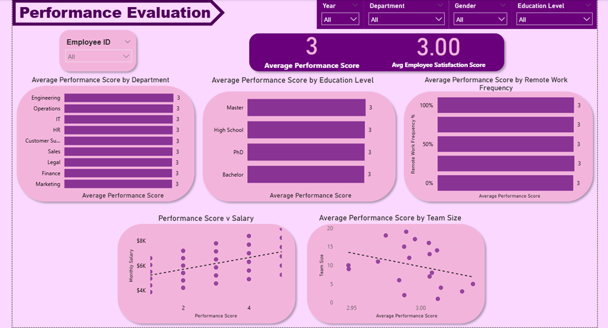
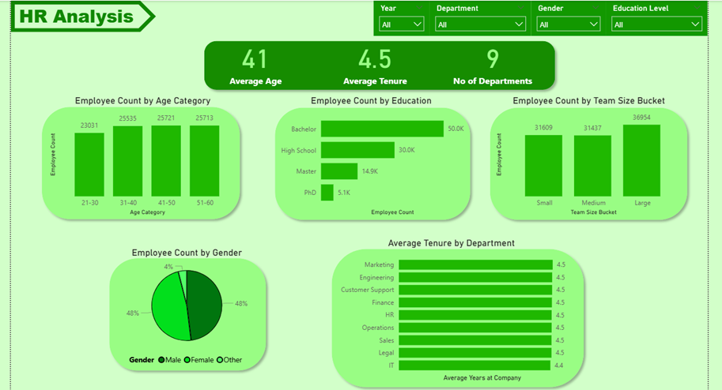

# Employee Performance and Productivity Analysis

## 📖 Overview
This project analyzes a dataset of 100,000 employee records, covering performance, productivity, and demographic factors in a corporate environment. The analysis focuses on key business areas such as employee churn prediction, productivity trends, performance evaluation, and HR insights.

The workflow involved:

1) **Data Cleaning** – Initial preprocessing and formatting using Excel.
2) **SQL Queries** – Data transformation, filtering, and problem-specific queries.
3) **Visualization** – Importing query outputs into Power BI to build interactive dashboards and visual reports.

## 🛠 Tools & Technologies
1. **Microsoft Excel** - Performed data cleaning, removed duplicates, formatted date columns, and created calculated columns using Power Query.
2. **PostgreSQL** - Wrote problem-specific queries and built data tables tailored to each analysis task. 
3. **VS Code** - Used as the development environment for writing and managing SQL scripts.
4. **Power BI** - Imported SQL query outputs, performed data modeling, and created interactive visualizations and dashboards.

## 📂 Data Source
* Kaggle - [Link for the dataset](https://www.kaggle.com/datasets/mexwell/employee-performance-and-productivity-data?utm_source=chatgpt.com)
* The raw data contains 100,000 rows and 20 columns

## 🔄 Workflow

### Microsoft Excel
Did some minor clean up like
1. Checking dupicate values in the 'Employee_id' column
2. Changed the format of the 'Hire_date' (Power Query)
3. Converted the column 'Remote_Work_Frequency' into a calculated column in order to get the percentage values.

### PostgreSQL
1. Made connection with the PGSQL Database.
2. Created a table to import the cleaned .csv file.
```
CREATE TABLE employee_performance (
    Employee_ID INT,
    Department TEXT,
    Gender TEXT,
    Age INT,
    Job_Title TEXT,
    Hire_Date DATE,
    Years_At_Company INT,
    Education_Level TEXT,
    Performance_Score INT,
    Monthly_Salary NUMERIC,
    Work_Hours_Per_Week INT,
    Projects_Handled INT,
    Overtime_Hours INT,
    Sick_Days INT,
    Remote_Work_Frequency NUMERIC,
    Team_Size INT,
    Training_Hours INT,
    Promotions INT,
    Employee_Satisfaction_Score NUMERIC,
    Resigned BOOLEAN
);

COPY employee_performance
FROM 'C:\Postgres Imports\data_for_query.csv'
WITH (FORMAT csv, HEADER true);
```
3. Tested if the table is working properly
```
SELECT *
FROM employee_performance;
```


4. Made further queries to accomodate each case
+ Categorizing employees by tenure group & work type
```
SELECT
    employee_id,
    CASE
        WHEN years_at_company < 1 THEN '<1 YR'
        WHEN years_at_company BETWEEN 1 AND 3 THEN '1-3 YRS'
        WHEN years_at_company BETWEEN 4 AND 6 THEN '4-6 YRS'
        ELSE '7+ YRS'
    END AS tenure_group,
    CASE
        WHEN remote_work_frequency = 0 THEN 'onsite'
        WHEN remote_work_frequency IN (0.25, 0.5, 0.75) THEN 'hybrid'
        ELSE 'fully remote'
    END AS work_type
FROM
    employee_performance
```
+ Categorizing employees by overtime status and training status
```
SELECT
    employee_id,
    CASE
        WHEN overtime_hours > 0 THEN 'Overtime'
        ELSE 'No Overtime'
    END AS overtime_status,
    CASE
        WHEN training_hours = 0 THEN 'No Training'
        ELSE 'With Training'
    END AS training_status
FROM
    employee_performance
```
+ Categorizing employees by age category and team size bucket
```
SELECT
    employee_id,
    age,
    CASE
        WHEN age BETWEEN 21 AND 30 THEN '21-30'
        WHEN age BETWEEN 31 AND 40 THEN '31-40'
        WHEN age BETWEEN 41 AND 50 THEN '41-50'
        ELSE '51-60'
    END AS age_category,
    CASE
        WHEN team_size BETWEEN 1 AND 6 THEN 'Small'
        WHEN team_size BETWEEN 7 AND 12 THEN 'Medium'
        ELSE 'Large'
    END AS team_size_bucket
FROM
    employee_performance
```
### Power BI
1. Imported the SQL queries into Power BI



2. Made dashboards for each case
+ Churn Prediction


+ Productivity Analysis
 

+ Performance Evaluation


+ HR Analysis


## 📈 Key Insights
+ **Churn Prediction**

    *1. Overall Churn Rate*
    * Out of 100,000 employees, 10,010 resigned, giving a 10% resignation rate.
    * This indicates a moderate level of churn, but still significant for workforce planning.

    *2. Department-wise Trends*
    * Finance, HR, and Legal show the highest resignation rates (~10.2-10.5%)
    * IT and Engineering show relatively lower churn (~9.5–9.6%).
    * Suggests that certain business functions may need targeted retention strategies.

    *3. Tenure Group*
    * Employees across all tenure groups have similar churn (9.8–10.1%).
    * Slightly higher resignation among 7+ years experienced employees (10.14%), which is concerning since they hold valuable experience.

    *4. Performance Score*
    * Churn is not strongly linked to performance—all performance bands (1–5) are around 9.7–10.1%.
    * Indicates high performers are leaving at the same rate as average performers—potential risk of losing top talent.

    *5. Work Type*
    * Remote and Hybrid employees have higher churn (~10.1%) than Onsite (9.5%).
    * Flexibility may not be enough to retain employees, or hybrid/remote roles may have weaker engagement.

    *6. Education Level*
    * Bachelor’s degree holders resign the most (5K+), followed by High School (3K)
    * PhDs show the lowest resignation (500+)—possibly due to niche skill sets or better job security.

    *7. Gender*
    * Male, Female, and Other genders have nearly identical resignation rates (~10%)
    * Suggests gender is not a significant driver of churn in this dataset.

    *8. Trends Over Time*
    * The resignation trend shows a peak around 2018–2019 and a decline more recently.
    * Could be linked to organizational changes, external economic factors, or HR interventions.

    **Conclusions**
    * Focus retention strategies on Finance, HR, and Legal departments.
    * Investigate why long-tenured employees are leaving.
    * Engage remote/hybrid workers more effectively.
    * Ensure high performers have growth opportunities, since they’re leaving at the same rate as others.

+ **Productivity Analysis**

    *1. Overall Productivity*
    + Employees handled an average of 24 projects.
    + Across the organization, the total workload was 2.44 million projects.

    *2. Work Type Comparison*
    + Onsite, Remote, and Hybrid employees all handled ~24 projects each.
    + Suggests that work location does not significantly impact productivity.

    *3. Department-wise Productivity*
    + Sales, Marketing, and IT departments show the highest average (25 projects).
    + Other departments, such as HR, Legal, and Finance, average around 24 projects.
    + Indicates a slight but noticeable higher workload in customer-facing and technical departments.
    
    *4. Overtime Effect*
    + Overtime does not seem to influence project output—both overtime and non-overtime employees average 24 projects.
    + Suggests overtime may not be translating into higher measurable productivity.

    *5. Training Impact*
    + Employees with training handled slightly more projects (25) compared to those without training (24).
    + Indicates that training has a marginal but positive effect on productivity.

    *6. Tenure vs. Productivity*
    + The scatter plot shows a slight upward trend between average years at the company and number of projects handled.
    + Suggests that longer-tenured employees tend to handle slightly more projects, likely due to experience and efficiency.

    **Conclusions**
    + Since training shows a small but positive impact, scaling up training programs may improve productivity further.
    + Overwork/overtime isn’t increasing productivity—focus could shift toward work-life balance instead of long hours.
    + Departments like Sales, Marketing, and IT may need additional support or resources given their relatively higher project loads.
    + Long-tenured employees contribute slightly more—retaining them could be valuable for maintaining steady productivity.

+ **Performance Evaluation**

    *1. Overall Performance & Satisfaction*
    * The average performance score is 3 (out of 5).
    * The average employee satisfaction score is also 3.0, showing a neutral or average sentiment overall.

    *2. Department-wise Performance*
    * Relatively, all the departments have the same average score (3)
    * Figures that all the departments perform at a moderate pace. Neither over-performing nor under-performing.

    *3. Education-wise Performance*
    * All the employee groups of differet education levels relatively have the same average performance score.
    * Figures that all the groups of different education levels perform at a moderate pace. Neither over-performing nor under-performing. 

    *4. Performance according to Remote Work Frequency*
    * All the groups relatively have the same average performance score.
    * All the groups perform at a moderate pace. Neither over-performing nor under-performing. 

    *5. Performance according to Salary*
    * The scatter plot shows a slight upward trend — employees with higher performance scores tend to have higher salaries.
    * Some variations could be noticed like some employees with lower scores earn higher than certain employees with a performance score of 5. This could be due to higher positions, work sector etc.  

    *6. Performance according to Team size*
    * The scatter plot shows a slight negative correlation — as team size increases, performance scores slightly decrease.
    * Suggests that smaller teams may allow for better performance outcomes.

    **Conclusions**
    * Uniform performance scores across departments, education levels, and work types suggest a standardized evaluation system—but it may also indicate a lack of differentiation in performance measurement.
    * The link between higher performance and higher salary supports merit-based pay systems.
    * Smaller teams show slightly higher performance, so leaner team structures may help maximize productivity.
    * Consider reviewing the performance evaluation methodology to ensure it truly differentiates between employee contributions.

+ **HR Analysis**

    *1. Employee Age Distribution*
    * Majority of employees are evenly spread between the 31–60 age groups (25K+ in each).
    * The youngest group (21–30) has slightly fewer employees (~23K), which could hint at lower recent recruitment or higher attrition among younger staff.

    *2. Education Levels*
    * Most employees hold at least a Bachelor’s degree (50K), followed by High School graduates (30K).
    * A smaller share have Master’s (15K) and PhDs (5K), showing the workforce is mainly undergraduate-qualified.

    *3. Gender Representation*
    * Male: 48% | Female: 48% | Other: 4% – Gender balance is nearly equal, with a small but notable presence of non-binary/other identities.
    * This reflects strong diversity compared to typical industry trends.

    *4. Team Size Distribution*
    * Employees are concentrated in large teams (37K), slightly more than medium (31K) and small teams (31K).
    * Larger teams may suggest centralized departments or higher collaboration requirements.

    *5. Tenure Insights*
    * Average tenure is 4.5 years, indicating moderate retention.
    * All departments show similar tenure (≈4.5 years), with IT slightly lower (4.4 years), suggesting higher turnover or faster career progression in tech roles.

    *6. Department Spread*
    * There are 9 departments represented.
    * No significant variation in average tenure across departments, but IT may warrant deeper retention analysis.

    **Conclusions**
    
    * Strengthen career growth and upskilling programs, especially in IT, to reduce turnover.
    * Boost recruitment of younger employees (21–30 age group) to balance workforce aging.
    * Maintain gender balance and expand support for non-binary/other employees to further inclusivity.
    * Encourage advanced degree sponsorships (Master’s, PhD) to increase highly skilled talent.
    * Review large teams (>37K employees) for efficiency and consider redistributing staff for better management.

## 📌 Access Files
1. Data (.csv) file - [File Location](https://github.com/krisshanr98/DA_project_employee_performance_and_productivity/blob/main/data_for_query.csv)
2. Power BI (.pbix) - [File Location](https://github.com/krisshanr98/DA_project_employee_performance_and_productivity/blob/main/Dashboard.pbix)
3. PostgreSQL (.sql) files - [Folder Location](https://github.com/krisshanr98/DA_project_employee_performance_and_productivity/tree/main/sql_queries)

## 📄 **License**
This project is open source for learning and personal portfolio use.  
Feel free to fork or adapt.

## ✏ **Author**
Built by *Krisshan Rajkumar* as part of a personal data analytics portfolio.